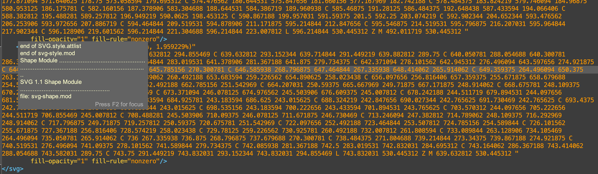

## *Star Wars Text Analysis*: Review

* Site publication: <https://jbg5721.github.io/StarWarsAnalysis/>
* GitHub repo: <https://github.com/jbg5721/StarWarsAnalysis>
* Developers: Joey Gardiner, Felipe Bassi, Thomas Hammer, Aidan Ray, Harrison Lilley
* Date of Evaluation: 2021-05-08
* Evaluated by: @ebeshero

### Research questions and project design
You wrote a good, clear explanation of your research questions about comparing the drafts of *A New Hope* from the introduction of your project and on the Structure and Character analysis pages. You found several different ways to compare the drafts using a variety of methods, and even incorporated Star Wars artwork to help visualize the changes through the drafts. 

#### Providing image metadata?
The very existence of that fan art speaks to a large community who care about your topic! You're using lots of images well known from the movies, but your slide shows on the [Structure Analysis page](https://jbg5721.github.io/StarWarsAnalysis/analysis.html) are showing us an interesting mixture of images, probably drawn from Wookiepedia and other fandom sites. Since you are building an authoritative resource analyzing the drafts, you should provide more metadata (literally, data about the data) on all the images. You could do an image credits page, but probably better is to provide a bit of "fine print" in the slide shows to credit the artists when you can identify them and at least the source site where they're featured. Are these licensed for you to share? (probably yes, but to be professional and safe, you want to be clear about that and state what you know). 

#### Documentation of your methods
On [the last (About) page](https://jbg5721.github.io/StarWarsAnalysis/about.html) of your project, you wrote an amusing little section titled "Behind the Curtains" where you sort of tease the viewer that there's more to be seen for the curious few who care about code. 

But your code for this project is much more important and interesting than that, really! You'd be surprised the number of fans and text analysts would love to get their hands on cleaned up scripts of *A New Hope*. Also for your own selves, as a way of documenting your work and sharing it with future employers, perhaps, I recommend that you do a *little* more to document your prep work on this site, in part to give yourselves due credit for your hard work, and to help people find their way to the "good stuff" you prepared! You could add it to that same page, just develop it more, maybe like this:

1. Share direct links to your cleaned up XML scripts, and also to the text files. You could do that in a list, listing them by title and linking directly to them in your GitHub repo. (It *is* a little hard to find them in the repo without some guidance.)
2. Share a link to your Step file documenting how you cleaned up the scripts. You could also comment on the XSLT stage, though that's something I added later. You could show the basic document structure you came up with.
3. Definitely add a [Creative Commons License](https://creativecommons.org/share-your-work/) to your project. This is serious professional work you're doing, and I think you should be cited for it by others if they want to work with your code. Take a moment with your team (even after the semester is over, yes) and decide on a license. 

Your document analysis and regex preparation for this project was a huge and important effort and is a major contribution to the community of Star Wars fans and coders in the galaxy.

### Analysis

Your project's analysis is fascinating for the number of different ways you were able to approach the topic. I wish the team had tried the natural language processing with Python on your well-curated scripts, to see if there are differences in the speech patterns of say Luke or Vader. But what you have here in the studies of scene counts and character appearances as well as setting changes is a fascinating study, and you made some especially interesting discoveries about the character changes of Luke from a big 60+ year old to a kid, about the early descriptions of Vader as a "general," and about R2D2's original speaking role. And you do a very good job of explaining the "big picture" view of your analysis: you tell us what the data shows about the drafts and why some of them are longer than others. What needs work are the finer details and the explanation of how you derived your data. 

#### SVG side-by-side histograms

The SVG histograms on the [Character Analysis page](https://jbg5721.github.io/StarWarsAnalysis/data.html) raise some questions about relative scaling. When I look at the graphs side by side showing "Luke's Total Appearance" next to "Vader's Total Appearance," they seem at first to be very comparable to each other. But I don't think that's what the graphs convey, do they? When I look at the Y axis markers, the Luke graph goes up to 300, while the Vader graph only goes up to 50. So am I really seeing a lot LESS of Vader than I do of Luke in any given script? If that is the case, it would be better to visualize it differently, to show how much more of Luke we see by contrast with Vader. Perhaps side-by-side bars on the same scale would convey that better? The percentage graphs raise similar questions about scaling: Both sets of graphs really make Vader *seem* more present than he is, if the scale only goes up to 5%! Is there a better way to visualize all this? I appreciate that the graphs don't "lie" to us, that we just have to read the scale, but their side-by-side positioning encourages comparison and visually, the comparison could probably be expressed more clearly a different way. 

About those interesting histograpms, the exploring Draft Lengths by Percentage on [the Structure Analysis page](https://jbg5721.github.io/StarWarsAnalysis/analysis.html) confuses me a little: How are the percentages understood--percentages of what? Did you calculate this based on....was it string-length of the drafts? Did you come up with a total quantity of all the drafts together and that was 100%? Or did you plot this based on scene counts of each draft or something else? Tell us how you derived your data here for visualizing! We need more documentation here. (Also the title of the Draft Lengths by percentage is misspelled ("Draft Lenghts").

#### Network visualizations
This area of your website is fascinating and very well documented! The interactive Cytoscape network lets us explore the five drafts and see where they share the same characters, and which ones have the most *different* range of characters. (The Rough draft really stands out here on investigation). You made some excellent choices in visualizing the network and embedding it on your site. 

### Website design and user experience

#### CSS
Really fine work on the CSS for this project, and I mean your tidy ordering of the CSS file and documentation of its sections--which code applies to what portion of the project. You made this part of the project very easy to maintain and share. 

#### Site menu
The code you adapted for the site menu is very cool with the geometric design and drop-down hover effect! You should document its specific source in your CSS file where you comment on it. 

Here is a CSS design challenge: Since most of your pages involve deep scrolling, can you find a way using CSS to make the menu drop down with you as you scroll, without getting in the way of the content? It should be possible since your menu is so concise, only taking up a tiny portion of the screen. 

#### SVG histogram graph code: Not Accessible!
Looking at the SVG code for your histograms, I was surprised to find them evidently *not* drawn or programmed directly by you via XQuery. They appear to have been made in something like Illustrator or another program that "cans" SVG code. This generates some thousands of lines of code, and the data is buried needlessly for simple histograpms, just to get a curved shape? Here's what the SVG code looks like, with completely unnecessary intricate `<path>` elements when all you need to be plotting is simple shapes! 

This kind of opaqueness creates what we call a "black box" out of an image file. SVG wasn't made to be distorted this way. For best practices in professional web design, and to meet accessibility standards, the SVG should not be like this. 

Making your website and your data maximally accessible means *keeping it simple* and easy to read. Think of people accessing visuals using braille monitors--they need the SVG text and chart data to be well organized in a meaningful way. And for *you* on the project team, if you wanted to make a simple hand edit to one of these graphs (say even to correct a misspelling or a height value), you can't just go to your webpage, find the SVG element in question and correct it because the data you need to find is so deeply buried in "spaghetti code." So when we talk about accessibility we're also talking about *ease of maintenance* of your project site.

Anyway, you can make those cool rounded corners and even the domes on your histograms yourselves with a simple `@rx` attribute on the `<rect>` element: see <https://developer.mozilla.org/en-US/docs/Web/SVG/Element/rect>. I know this talented team can make *much* better SVGs yourselves in fewer lines of code. In web development, always go with a lightweight solution; don't use heavyweight "bloated code" when it's unnecessary. That *does* mean taking a stand in the web developing community not to be dependent on software that produces "code bloat" just because it's convenient. We can do better than that and as I saw from your SVG homework assignments, you could write and program the code for styled histograms just fine yourselves, *including* hash marks. 

#### Meet the Team
The "Meet the Team" section is one of the more perfect portions of the site, and I salute "Commander Regex," "Data Bounty Hunter," and "Text Analyst Padawan" and their action figure heads. (I hope that Harrison locates an action figure to match!) 

### Concluding comments

When I write up comments on semester projects, I always hope the developers will pick up the project and make some upgrades or find a way to continue it. Even if you don't ever seriously return to this project, you learned a lot from building this project, curating your data, extracting and analyzing it, designing a visually appealing and easily navigable site, and writing up your findings. You accomplished a great deal that you can be proud of! There are also definitely places to improve:

* designing your own SVG 
* providing better documentation of your methods in preparing the histograms
* providing direct links to the scripts as you cleaned them up and curated them 
* A small but professional touch: italicize the titles of the drafts wherever they come up.

Overall I hope you make a few small changes at least, thinking about how this project will reflect on you professionally as part of your portfolios as developers and designers! Add that Creative Commons license, feature your "text-wrangling" work to share those XML scripts and cleaned-up text files directly, and work on adding some metadata to polish up this site. It's a wonderful resource for the Star Wars fandom and coders alike! 
